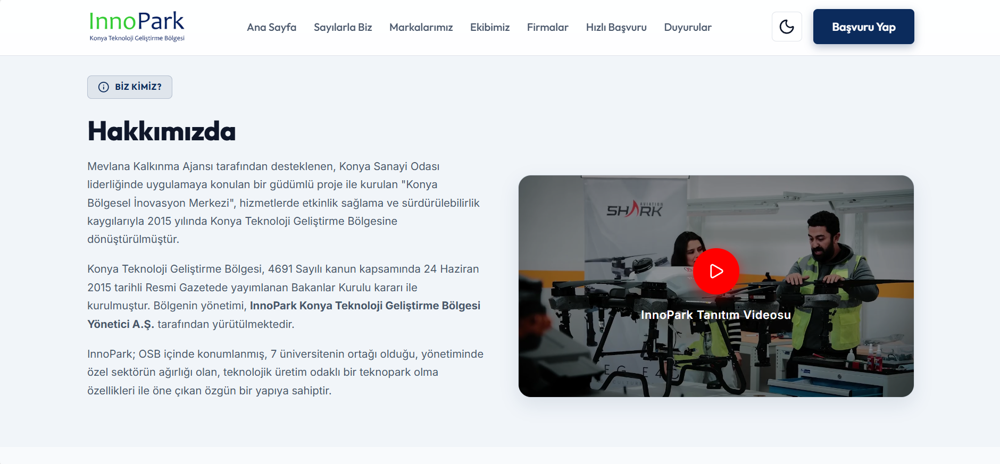
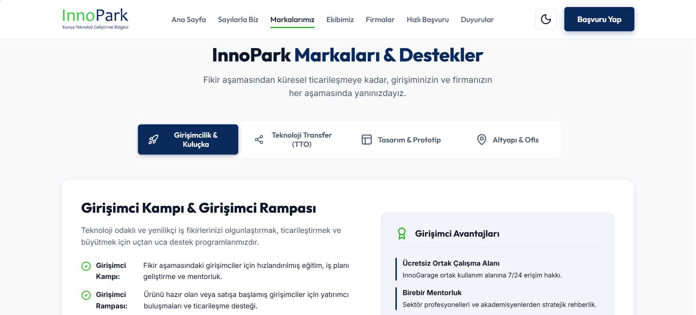
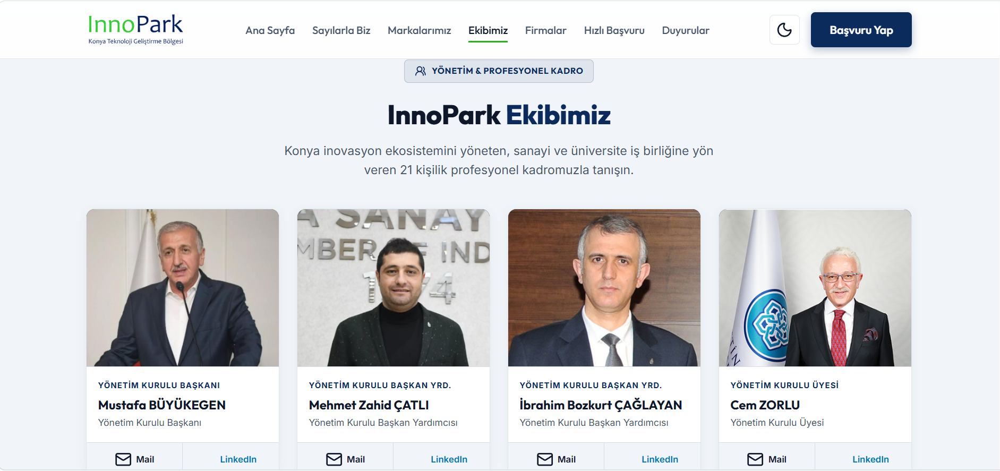
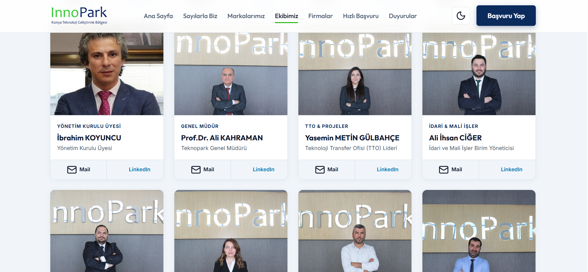
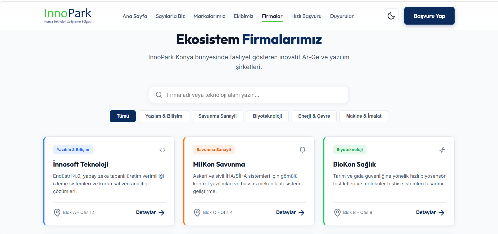
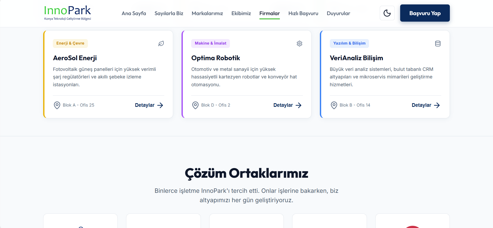
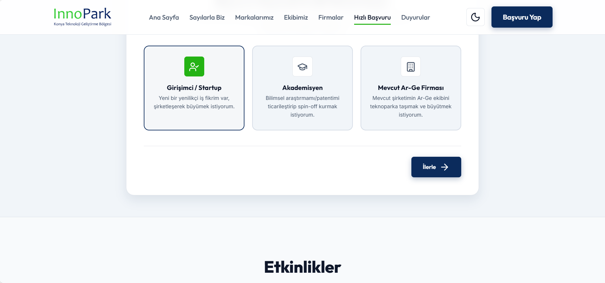
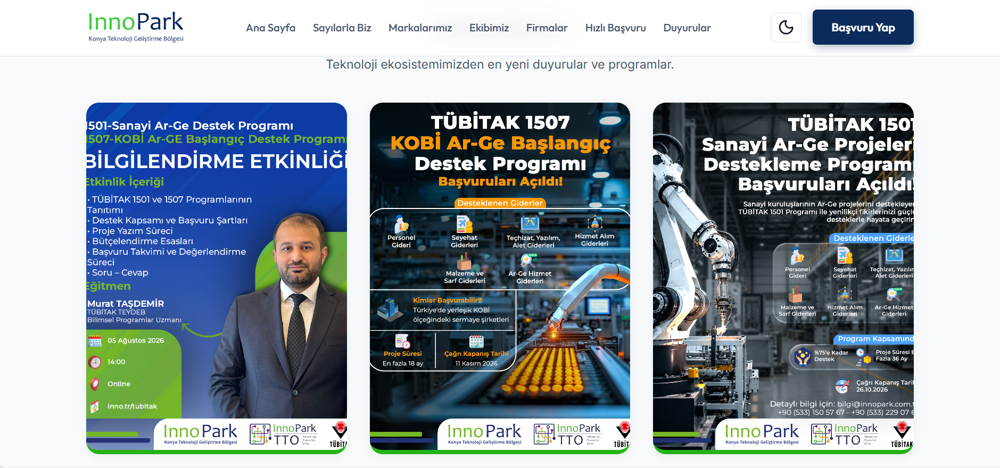
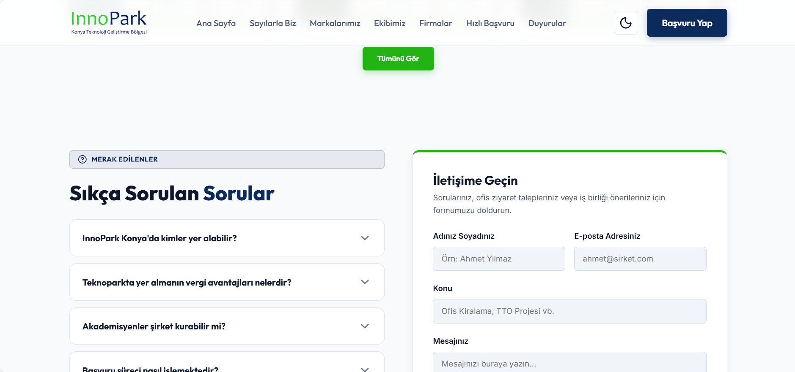
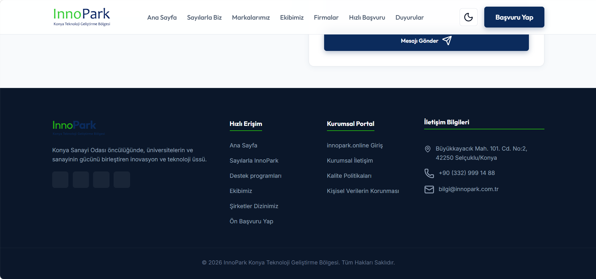

# Innopark Konya Teknoloji Transfer Ofisi - Web Sitesi

Bu web projesinin tüm arayüz tasarımı ve kodlaması tamamen **Aleyna Kardelen Akın** tarafından sıfırdan geliştirilmiştir.

## Proje Hakkında
Innopark Konya için özel olarak kodlanan bu yeni web sitesi; modern, hızlı ve kullanıcı dostu bir yapı sunmaktadır.

## Ekran Görüntüleri

Ana sayfa ve genel görünüm:

  
<b>Tüm Ekran Görüntülerini Görmek İçin Tıklayın (20 Görsel)</b>

  
   
  
  
  
  
  
  
  
  
  
  
  
  
  
  
  
  
  
  
  
  
  

## Geliştirici
* **Aleyna Kardelen Akın**

## Kullanılan Teknolojiler
* HTML5
* CSS3
* JavaScript
